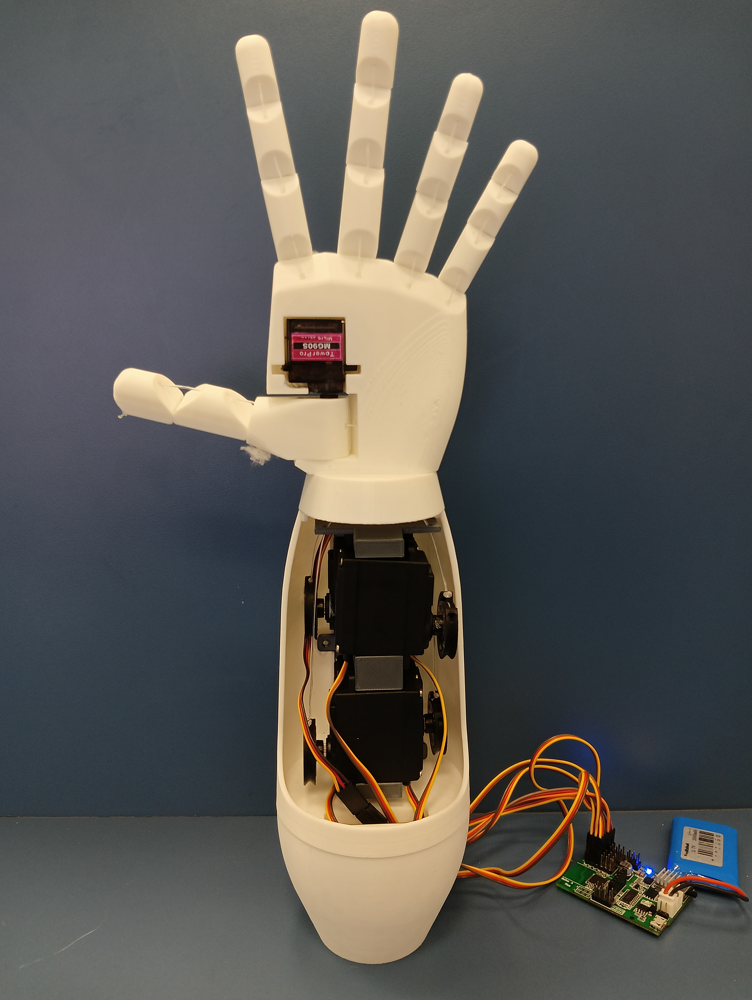

# Hand-Tracking Robotic Hand

A fun and interactive project that lets you control a physical robotic hand in real time using your hand gestures captured by a webcam.

Hold your hand up to the camera and the robotic hand mirrors your movements like opening and closing fingers, opposing the thumb, and even rotating the wrist. 

<video>
  <source src="Media/Robotic_Hand_demo_vid.mp4" type="video/mp4">
</video>

## Project Overview
MediaPipe detects your hand landmarks, a Python script interprets the gestures, and sends simple serial commands to an Arduino that drives the servos in the robotic hand.

## Key Features
- Hand tracking with MediaPipe Hands
- Hand rotation detection and mirroring
- Speed Controlled Movement
- Clean serial communication between Python and Arduino

## Hardware Used
- Arduino board
- 6 standard servos, like MG996r (Speed controlled servos used here, but Position controlled Servos will work as well with changes in code)
- 1 Micro Servo Motor, like MG90S
- Webcam
- 3D-printed robotic hand structure (from https://www.thingiverse.com/thing:2269115)
- Simple wiring

## Software Requirements
- Arduino
- Python 3
- OpenCV
- MediaPipe
- PySerial

## How to Use
1. Install required Python packages
    ```
    pip install opencv-python mediapipe pyfirmata2 numpy
    ```
2. Connect your board via USB (for upload and serial)
3. Upload the Arduino sketch to your board
4. Connect the servos to the correct pins
5. Run the Python script
    ```
    python Robot_Hand_Mediapipe.py
    ```

